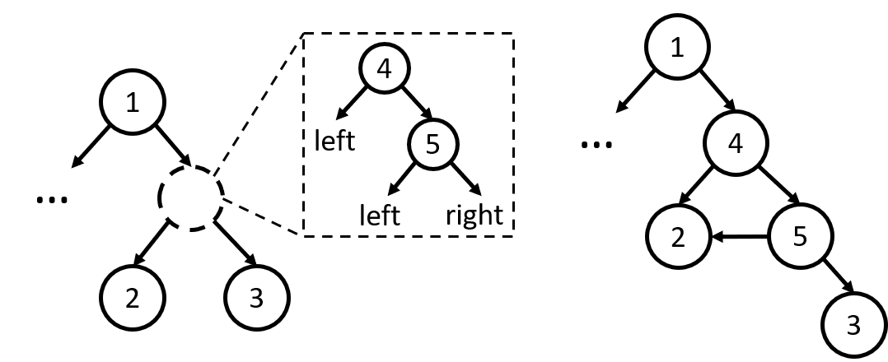
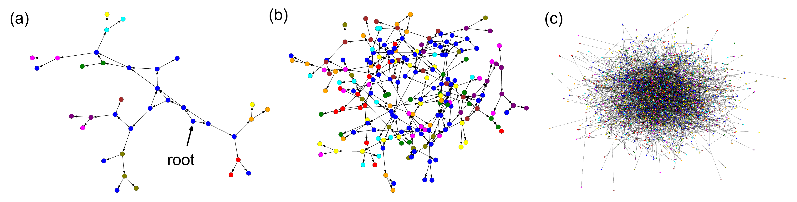

# Tree in Tree: from Decision Trees to Decision Graphs

This repository is the implementation of [Tree in Tree: from Decision Trees to Decision Graphs](https://arxiv.org/abs/2110.00392). 



## Visualization

Visualization examples of the fitted TnT graph structures:



- (Optional) install sknetwork to enable visualization:
```bash
pip install scikit-network
```


## Results
\# S indicates the number of split nodes, which is an estimate of model complexity.

|  Model | Dataset  | # S  | Accuracy |
| ------------------ |---------------- | -------------- | -------------- |
| TnT  |    MNIST        |      600      |     90.87±0.31       |
| CART  |     MNIST         |      1.1k       |    88.59±0.14      |
| TnT  |    Connect-4        |      864      |     78.85±0.46       |
| CART  |     Connect-4         |      931       |    77.23±0.01      |
| TnT  |    Letter      |      1.2k     |     86.62±0.02       |
| CART  |     Letter         |      1.3k       |    86.26±0.15      |
| TnT  |    Optical recognition     |      174     |     86.32±0.24       |
| CART  |     Optical recognition         |      193       |    85.56±0.46      |
| TnT  |    Pendigits       |      125     |     92.61±0.53       |
| CART  |     Pendigits         |    166       |    91.74±0.13      |
| TnT  |    Protein       |      69      |     57.26       |
| CART  |     Protein         |     76       |    55.30      |
| TnT  |    SenseIT     |      198    |     80.48±0.42       |
| CART  |     SenseIT         |      345       |    79.40      |
| TnT  |    USPS       |      31      |     88.76±1.36       |
| CART  |     USPS         |      109       |    87.35±0.15      |

## Citation
If you use this code for research, please consider citing our paper:
```
@misc{zhu2021tree,
      title={Tree in Tree: from Decision Trees to Decision Graphs}, 
      author={Bingzhao Zhu and Mahsa Shoaran},
      year={2021},
      eprint={2110.00392},
      archivePrefix={arXiv},
      primaryClass={cs.LG}
}
