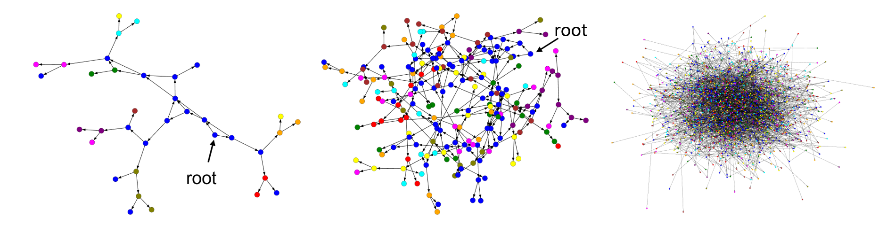

# Tree in Tree: from Decision Trees to Decision Graphs

This repository is the official implementation of [Tree in Tree: from Decision Trees to Decision Graphs](https://arxiv.org/abs/2110.00392). 


## Visualization

Visualization examples of the fitted TnT graph structures:




## Results

|  MNIST(pixels)  | CART  | TnT |
| ------------------ |---------------- | -------------- |
| Model complexity  |     85%         |      95%       |
| Test accuracy  |     85%         |      95%       |


## Citation
If you use this code for research, please consider citing our paper:
```
@misc{zhu2021tree,
      title={Tree in Tree: from Decision Trees to Decision Graphs}, 
      author={Bingzhao Zhu and Mahsa Shoaran},
      year={2021},
      eprint={2110.00392},
      archivePrefix={arXiv},
      primaryClass={cs.LG}
}
